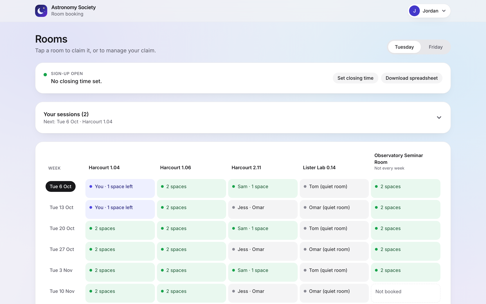
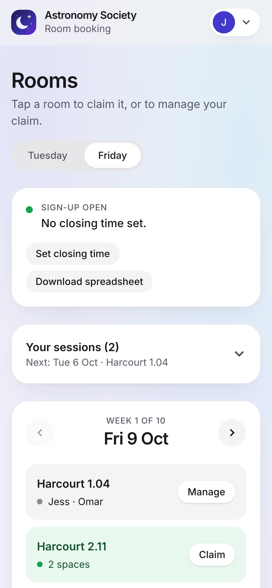
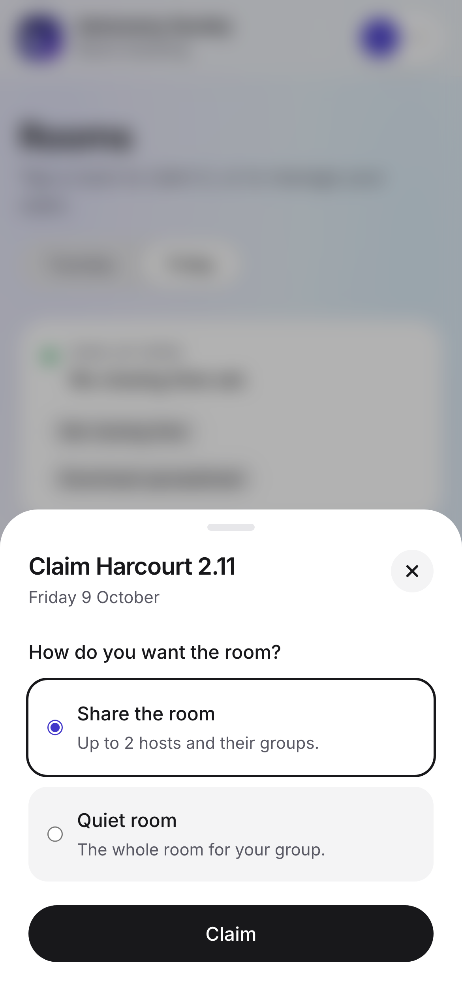
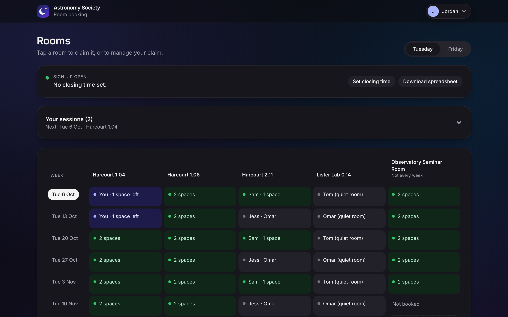
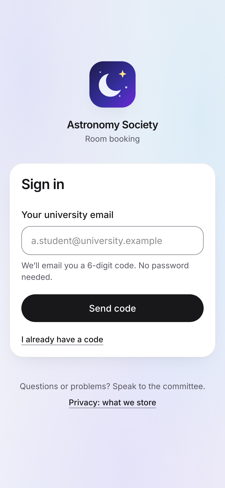

# Room booking system

A mobile-first web app for sharing out a block of booked rooms among the people who need them. It was built for a university society whose members run weekly sessions in rooms the society books each term. Before this, members claimed rooms in a shared spreadsheet, and that went badly: overwritten cells, double bookings, and nobody sure who had what.

This repo shows it set up for a fictional **Astronomy Society**, with made-up rooms and people.

| Room grid (desktop) | Week view (phone) | Claiming a room |
| --- | --- | --- |
|  |  |  |

| Dark mode | Sign-in |
| --- | --- |
|  |  |

## What it does

**For hosts** (the people running sessions):

- **Sign in** with a 6-digit code sent to their university email. There's no password, and only one email domain is allowed.
- **See every room**, week by week on a phone or as a whole-term grid on a larger screen. The grid updates live as other people claim rooms.
- **Claim a room** for one night, either shared (up to 2 hosts) or as a quiet room for one group.
- **Claim every week at once.** This is all or nothing: if any week has been taken, nothing is booked and the host is told which weeks clashed.
- **Release** one week or all remaining weeks, and **add sessions to their calendar** (`.ics` file).

**For the committee:**

- **Clear anyone's claim**, with a confirmation step.
- **Read the claim history:** every claim, release and clear, with who did it and when.
- **Set a closing time.** After it, hosts can no longer claim or release, so the final list stays fixed.
- **Download an editable `.xlsx`:** a weeks × rooms grid per day, a filterable list of claims, and the history.

Rules the database enforces, whatever the client does:

- One room per host per night.
- At most two hosts per room, or one if it's a quiet room.
- No claims on past or cancelled sessions, or after the closing time.
- Rooms that aren't booked every week can't be claimed "every week".

## How it's built

- **Frontend:** React 19, TypeScript, Vite, Tailwind CSS 4, React Router.
- **Backend:** Supabase (Postgres, Auth, Realtime). There's no custom server: all the business rules live in the database.

### The database does the enforcing

- **Access rules on every table** (row-level security). Signed-out visitors can read nothing. Signed-in users can read rooms and claims but can't write them directly.
- **Claims go through database functions** (`claim_slot`, `claim_series`, `release_*`, `clear_claim`). Each checks the rules and reports problems as reason codes (`room_full`, `already_booked_tonight`, `claims_closed`, …). The app turns those codes into plain-English messages.
- **Safe when everyone claims at once.**
  - Each claim locks its room's row, so two people can't take the last space together.
  - Each host's claims also run one at a time, so the same person can't grab two rooms on one night from two tabs.
  - "Every week" claims lock their rooms in date order, so two of them can't block each other.
- **The claim history is written by database triggers,** so no claim, release or clear can skip being logged. Entries record names as they were at the time, so later renames don't rewrite the past.
- **Only the allowed email domain can sign up.** A Supabase Auth hook rejects other addresses at sign-up. As a backstop, the access rules check the domain again.

### The frontend is layered

```
src/
  domain/   Rules and types, with no React and no Supabase (which rooms can be claimed, calendar files, dates)
  data/     The only code that talks to Supabase; turns its results into domain types
  ui/       React screens; they get data access from a context, so tests can swap in fakes
  config.ts Everything specific to one organisation
```

The domain layer mirrors the database's rules, so the app only offers what will succeed. When something changes between opening a room and claiming it, the database's answer wins: the app refreshes and explains what happened.

### Details worth a look

- **Live updates** use Supabase Realtime. Bursts of changes (an "every week" claim can be 10+ rows) are batched into one reload. The app also reloads after a dropped connection comes back, and when the page returns to view.
- **Accessibility:**
  - Everything works by keyboard, and sheets keep focus inside.
  - Every colour pair meets WCAG AA contrast in light and dark mode.
  - Room state is always written in words, never shown by colour alone.
  - Motion is turned off for users who ask for reduced motion.
- **Theming:** the colours live in one place (`src/index.css`) as named values, and components use those names. So light mode, dark mode and a device-following mode need almost no extra code.
- **Small first load:** the spreadsheet library loads only when someone clicks export, and the big libraries are in separate files from the app's own code, so updates stay small.
- **Time zones:** dates are the site's calendar dates. "Today", the closing time and calendar events all use one configured time zone, wherever the phone is.

## Tests

| Command | What it covers |
| --- | --- |
| `npm test` | Domain rules and every screen, using in-memory fakes (Vitest + Testing Library) |
| `npm run test:db` | Database rules, access and concurrency edge cases (pgTAP) |
| `npm run test:integration` | Real sign-in, claims, closing time and live updates against the local Supabase stack |

## Running it locally

You need Node 20+, Docker and the [Supabase CLI](https://supabase.com/docs/guides/cli).

```sh
npm install
supabase start                      # local Postgres, Auth, Realtime and a mail catcher
cp .env.example .env.development.local
# paste PUBLISHABLE_KEY from `supabase status` into .env.development.local
npm run dev:claims                  # optional: six fake hosts with a spread of claims
npm run dev
```

Sign in with any `name@university.example` address. The code arrives in the local mail catcher at http://127.0.0.1:54324.

To make yourself committee, run this in Supabase Studio (http://127.0.0.1:54323) or in `psql`, once you've signed in:

```sql
insert into public.committee (user_id)
select id from auth.users where email = 'you@university.example';
```

## Using it for your own rooms

### 1. Put your bookings in a CSV

`seed-data/sessions.csv` has one line per room per night:

```csv
date,day,room
2026-10-06,Tuesday,Harcourt 1.04
2026-10-06,Tuesday,Harcourt 1.06
2026-10-09,Friday,Harcourt 1.04
```

- **Days:** any weekday works, and the day tabs show whichever days appear.
- **Room order:** rooms are displayed in the order they first appear in the file.
- **Part-term rooms:** a room missing from some weeks is marked "Not every week" automatically.

If your bookings come as PDFs from a venue, copy the tables into a spreadsheet and save as CSV. The next step catches any mistakes.

### 2. Check and load it

```sh
node scripts/build-seed.mjs   # checks every line and writes supabase/seed.sql
supabase db reset             # local: rebuilds the database and loads the seed
```

The checker stops at the first problem and names the line: a bad date, a day that doesn't match its date, a duplicate room on the same night, or a blank room. For a hosted project, run `supabase/seed.sql` in the SQL editor. It's safe to re-run.

### 3. Change the settings

| Setting | Where |
| --- | --- |
| Name, contact, email domain, time zone, session times, calendar details | `src/config.ts` |
| Allowed email domain (enforced at sign-up) | `private.allowed_email_domain()` in `supabase/migrations/20260924130300_auth_domain_hook.sql` |
| Time zone for "today" in the database | `private.site_time_zone()` in `supabase/migrations/20260924130200_claims.sql` |
| Logo and favicon | `src/assets/logo.svg`, `public/` |
| Sign-in email | `supabase/templates/sign-in-code.html` and the email subjects in `supabase/config.toml` |

The email domain and time zone appear in both the app and the database. Change them in both places.

### 4. Deploying

1. Create a Supabase project and run `supabase db push`.
2. Turn on the "Before user created" auth hook (`public.hook_restrict_signup_domain`).
3. Set up email: the sign-in code template, plus an SMTP provider for real volumes.
4. Deploy the frontend to any static host with `VITE_SUPABASE_URL` and `VITE_SUPABASE_PUBLISHABLE_KEY` set. Send every path to `index.html`, so links to a day or week work.

### 5. End of term

1. Set a closing time.
2. Download the spreadsheet.
3. Delete everyone's data: `truncate public.sessions, public.claim_history cascade;`, then delete the users under Authentication → Users.

The in-app privacy note tells users this happens.
